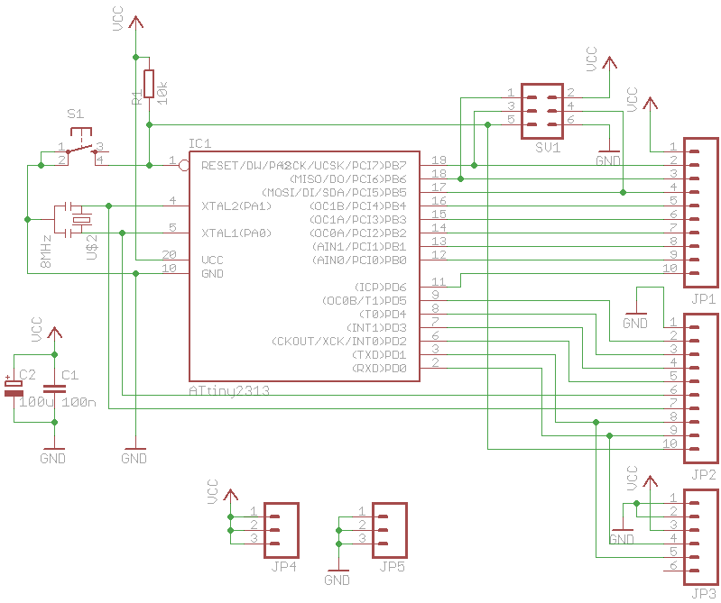
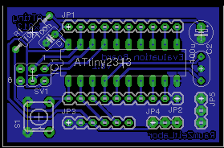

# ATtiny x2313 Breakout Board

Want to try something out with an ATtiny2313 or 4313? Don't want to do it on a breadboard? Well, here you go.

This is a single sided board, with the schematics of [Alex Weber](http://tinkerlog.com/2009/01/18/attiny-breadboard-headers/)'s ATtiny breadboard adapter.

## Schematic

## Board

